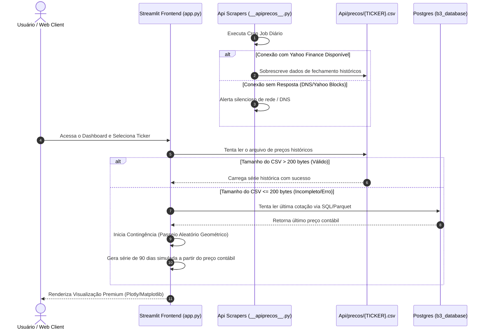

# 🏛️ Documentação de Arquitetura: Neo-B3 Obsidian

Este documento descreve os padrões de projeto, fluxos de dados, topologia de rede e resiliência adotados na arquitetura do hub financeiro **Neo-B3 Obsidian**.

---

## 1. Topologia e Fluxo de Dados Global

O sistema opera com um fluxo assíncrono e desconectado para garantir estabilidade. O carregamento de dados em tempo real não impede o funcionamento da interface, mesmo que haja falha de rede/DNS no Yahoo Finance:

---

## 2. Padrões de Design e Estrutura dos Arquivos de Dados (`Api/`)

Os pipelines de dados locais salvam cotações e relatórios estruturados no formato CSV delimitado por ponto e vírgula (`;`). Os schemas de cada módulo estão documentados abaixo:

### A. Preços Históricos (`Api/precos/*.csv`)
Gera a série histórica de cotação diária do ativo.
- **Date**: `YYYY-MM-DD` (Data do pregão).
- **Adj Close / Close**: `float` (Preço de fechamento ajustado).
- **Open**: `float` (Preço de abertura).
- **ret**: `float` (Retorno percentual em relação ao dia anterior).
- **tret**: `float` (Retorno acumulado somado temporalmente).
- **Returns**: `float` (Retorno decimal simples).
- **Vol**: `float` (Volatilidade anualizada calculada na janela de 20 pregões).
- **MM20**: `float` (Média Móvel Aritmética de 20 pregões).
- **Detrend**: `float` (Preço da ação subtraído da média móvel para detecção de tendências).

### B. Proventos & Dividendos (`Api/proventos/*.csv`)
Registros históricos de distribuição de proventos.
- **Data**: `DD/MM/YYYY` (Data-com ou data de referência de direito).
- **Valor**: `float` (Valor por ação).
- **Tipo**: `string` (DIVIDENDO ou JUROS SOBRE CAPITAL PROPRIO).
- **Data de Pagamento**: `DD/MM/YYYY` ou `-` (Data em que o capital é creditado).
- **Por quantas ações**: `int` (Fator multiplicador do direito).

---

## 3. Modelo de Resiliência DNS e Contingência Local

O hub foi projetado sob a filosofia de **Graceful Degradation** (Degradação Suave). Diante de falhas na rede local para com as APIs públicas do Yahoo Finance, o Streamlit é mantido em funcionamento pleno por meio de simulações em tempo real:

1. **Preço Contábil de Partida**: O sistema consulta a última cotação consolidada do ativo a partir do banco de dados (tabela carregada no `dados.csv`).
2. **Passeio Aleatório Geométrico (GBM)**: É gerado um histórico de 90 dias simulado por um passeio aleatório baseado em ruído gaussiano ($\mu = 0.02\%$, $\sigma = 1.5\%$):
   $$S_t = S_{t-1} \times (1 + N(\mu, \sigma))$$
3. **Cálculos Secundários Dinâmicos**: A volatilidade (`Vol`), médias móveis (`MM20`), detrend e retornos acumulados são recalculados em cima da série simulada, permitindo que todas as abas, tabelas e gráficos da aplicação sejam renderizados sem exibir telas de erro ao usuário.

---

## 4. Integração de Serviços (Docker / Compose Stack)

A infraestrutura local é orquestrada através do Docker Compose, dividida em serviços isolados por redes virtuais internas para segurança:

* **b3_database**: Container PostgreSQL responsável pela persistência das tabelas e do histórico bruto das empresas listadas.
* **b3_dashboard**: Container contendo o ecossistema Streamlit e as engines Python do projeto.
* **Network isolation**: O dashboard interage diretamente com o banco PostgreSQL via porta padrão `5432` através de uma rede privada de alto desempenho, expondo apenas a porta visual do Streamlit (`8501`) para o tráfego externo da máquina local.
