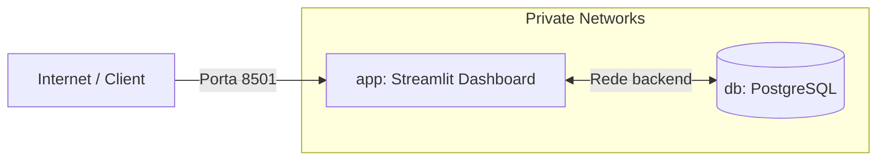

# ⚙️ Operação, Deploy & Infraestrutura (CI/CD e Docker)

Esta documentação descreve as estratégias de conteinerização, segurança em execução, isolamento de rede virtual e fluxos de Integração Contínua (CI/CD) implementados no projeto **Neo-B3 Obsidian**.

---

## 1. Conteinerização de Alta Performance (`Dockerfile`)

O aplicativo utiliza um arquivo de compilação Docker estruturado em **Multi-stage Build** (compilação em múltiplos estágios) com foco na redução radical do tamanho da imagem final e garantia de segurança do ambiente.

### A. Arquitetura em Múltiplos Estágios:
1. **Estágio 1 (Builder)**: Utiliza a imagem leve `python:3.11-slim` como base.
   - Instala a ferramenta de alta performance `uv` diretamente da imagem oficial do GitHub Registry (`ghcr.io/astral-sh/uv:latest`).
   - Copia apenas os arquivos de lock de dependências (`pyproject.toml` e `uv.lock`) e executa `uv sync --frozen --no-dev --no-install-project` para montar um ambiente virtual Python isolado de produção (`.venv`), totalmente livre de dependências de desenvolvimento.
2. **Estágio 2 (Runner)**: Cria a imagem de execução final limpa, também baseada em `python:3.11-slim`.
   - Copia somente a pasta `.venv` pré-compilada e o código fonte bruto do Estágio 1, economizando centenas de megabytes.

### B. Práticas de Segurança em Runtime:
- **Usuário Não-Root**: O container cria um grupo e um usuário de sistema dedicados (`streamlit`) e atribui a eles todas as permissões de leitura/escrita da pasta de execução `/app`. O container executa sob as credenciais desse usuário não-privilegiado (`USER streamlit`), mitigando riscos de escalada de privilégios caso haja alguma vulnerabilidade de segurança.
- **Porta Exposta**: A porta de serviço do Streamlit é padronizada como `8501`.

---

## 2. Orquestração de Containers (`docker-compose.yml`)

Utilizamos o **Docker Compose** para gerenciar os dois serviços principais que compõem o ecossistema local do projeto:



### A. Serviços Orquestrados:
1. **`app` (Dashboard Streamlit)**:
   - Compila a imagem local a partir do estágio `runner` do Dockerfile.
   - Depende da saúde contínua do banco de dados por meio da diretiva `depends_on` (condicionada a `service_healthy` do Postgres).
   - Limites de hardware severos: CPUs travadas em até `1.0` (um núcleo) e memória física limitada em no máximo `1GB` para evitar memory leaks.
2. **`db` (PostgreSQL 13)**:
   - Configurado a partir da pasta `/Docker` para inicializar com localizações corretas em português brasileiro (`pt_BR.UTF-8`) para exibição perfeita de datas no banco de dados.
   - Volumes locais mapeados de forma persistente (`postgres_data`) sob `/var/lib/postgresql/data/` para evitar perda de dados nas reinicializações de container.
   - Limites de hardware: CPUs travadas em `0.5` e memória física limitada a `512MB`.

### B. Segregação e Isolamento de Redes:
Para impedir invasões diretas no banco de dados a partir da rede externa, criamos redes distintas:
* **Rede `frontend`**: Exposta. Conecta o serviço `app` à internet local na porta `8501:8501`.
* **Rede `backend`**: Interna e privada. Conecta de forma exclusiva o serviço de dados `db` e o painel `app`. O Postgres não expõe portas para a máquina hospedeira externa, inviabilizando varreduras de portas ou acessos externos sem autorização.

### C. Healthcheck Ativo (Saúde de Conexão)
O serviço de dados implementa um mecanismo de checagem interna de funcionamento (`healthcheck`):
```yaml
healthcheck:
  test: ["CMD-SHELL", "pg_isready -U root -d dados_financeiros"]
  interval: 10s
  timeout: 5s
  retries: 5
```
Isso garante que o Streamlit só iniciará suas conexões SQL após o banco do PostgreSQL estar 100% inicializado e aceitando conexões.

---

## 3. Pipeline de Integração Contínua (GitHub Actions - `ci.yml`)

Nosso pipeline de CI localizado na pasta `.github/workflows/ci.yml` automatiza a validação de qualidade e corretude lógica a cada push ou Pull Request no branch `main`.

### A. Etapas do Pipeline:
1. **Serviço de Banco de Dados**: Cria uma instância em tempo real do Postgres no próprio Actions Service containerizado para executar os testes de persistência integrados.
2. **Set up Python 3.11** & **Astral uv**: Ativa o Python e o Setup-uv com **cache automático habilitado** (`enable-cache: true`), reduzindo o tempo de build em mais de 75%.
3. **Instalação das dependências**: Executa `uv sync --frozen` para garantir consistência reproduzível idêntica em cada run de teste.
4. **Validações Estritas**:
   - Executa Ruff Linter (`uv run ruff check .`).
   - Executa Ruff Formatter (`uv run ruff format --check .`).
   - Roda a suíte completa de testes automatizados com variáveis de ambiente injetadas em tempo real (`uv run pytest`).
