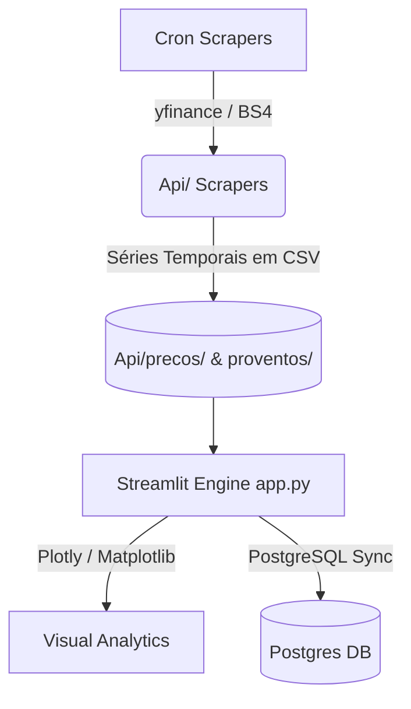

# 📊 Neo-B3 Obsidian: Hub Financeiro Resiliente

[](https://github.com/Prog-LucasAlves/PUB_Dados_Financeiros_B3/actions/workflows/ci.yml)


**Neo-B3 Obsidian** é uma plataforma analítica integrada de alta performance para monitoramento de ativos listados na Bolsa de Valores brasileira (B3). O sistema foi arquitetado sob a filosofia de **Graceful Degradation** (resiliência sob falhas de rede), alimentando um dashboardStreamlit elegante em modo escuro profundo e automatizando pipelines robustos de scraping e envio de e-mails analíticos.

🚀 **Acesse o Hub em Produção**: [dados-financeiros.onrender.com](https://dados-financeiros.onrender.com/)
🌐 **Portal do Desenvolvedor**: [prog-lucasalves.github.io/PUB_Dados_Financeiros_B3](https://prog-lucasalves.github.io/PUB_Dados_Financeiros_B3/)

---

## 🏛️ Estrutura e Fluxo de Arquitetura

O ecossistema opera de forma desacoplada para garantir integridade. Os dados históricos e de relatórios locais são salvos no formato CSV delimitado e estruturados em camadas virtuais isoladas por containers:



---

## 📚 Central de Documentação Técnica (Wiki)

Implementamos uma base de conhecimento detalhada dividida por especialidades do projeto:

* **[🏛️ Docs/architecture.md](Docs/architecture.md)**: Visão geral da topologia, fluxos de dados baseados em diagramas de sequência Mermaid e detalhamento matemático da **contingência de Passeio Aleatório Geométrico (GBM)** sob restrições de rede local.
* **[🚀 Docs/onboarding.md](Docs/onboarding.md)**: Setup ágil passo a passo do ambiente para novos desenvolvedores, configurações do console e execução de testes.
* **[⚙️ Docs/api_pipelines.md](Docs/api_pipelines.md)**: Funcionamento interno dos scrapers, parser dinâmico `MultiIndex vs SingleIndex` para o Yahoo Finance e extrações estruturadas no BeautifulSoup.
* **[📊 Docs/schemas_csv.md](Docs/schemas_csv.md)**: Dicionário de dados físico detalhando tipos de dados, limites e chaves de todas as tabelas CSV locais.
* **[🎨 Docs/reports_visual.md](Docs/reports_visual.md)**: Padrão estético *Obsidian Dark Theme* no Matplotlib/Seaborn, mapas de correlação multivariados e e-mails corporativos responsivos de 680px.
* **[🔧 Docs/ops_deployment.md](Docs/ops_deployment.md)**: Dockerização multi-stage, segregação de redes de dados em containers seguros não-root e esteira de CI/CD do GitHub Actions.

---

## ⚡ Setup e Instalação Local (Ultra-rápido)

O projeto utiliza o **Astral uv** (gerenciador de pacotes e dependências Python de altíssima velocidade) para manter compilações consistentes e reprodutíveis:

### 1. Criando o ambiente virtual e sincronizando dependências
```bash
# Clone o repositório
git clone https://github.com/Prog-LucasAlves/PUB_Dados_Financeiros_B3.git
cd PUB_Dados_Financeiros_B3

# Cria o ambiente virtual (.venv) e instala dependências de produção de forma idêntica
uv sync --frozen
```

### 2. Configurando o banco de dados (Docker Compose)
Levante a infraestrutura local contendo o PostgreSQL com localizações em português brasileiro com apenas um comando:
```bash
docker-compose up -d
```

### 3. Executando o Dashboard Streamlit
```bash
uv run streamlit run app.py
```
O painel estará disponível localmente no endereço: [http://localhost:8501](http://localhost:8501).

---

## 🛡️ Desenvolvimento e Qualidade do Código

Mantemos qualidade estrita de código por meio de testes automatizados e linters:

* **Verificar formatação e erros (Ruff Linter)**:
  ```bash
  uv run ruff check .
  ```
* **Reformatar arquivos automaticamente (Ruff Formatter)**:
  ```bash
  uv run ruff format .
  ```
* **Executar a suíte de testes unitários (`pytest`)**:
  ```bash
  uv run pytest
  ```

---

## 🛠️ Tecnologias Utilizadas

* **Linguagem**: Python ^3.11.5
* **Interface Visual**: Streamlit ^1.57.0 (com Plotly Express e Seaborn)
* **Gerenciador de Pacotes**: Astral uv (em substituição ao Poetry legado)
* **Banco de Dados**: PostgreSQL 13 + Docker Compose
* **Qualidade**: Ruff (Linter & Formatter) + Pytest (Testes)
* **CI/CD**: GitHub Actions (Esteira automatizada com Postgres Service containerizado)
